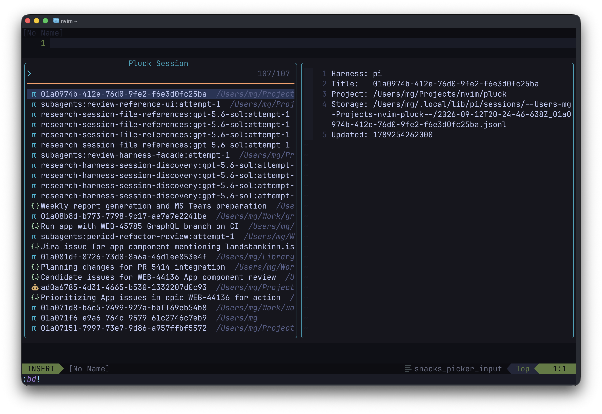
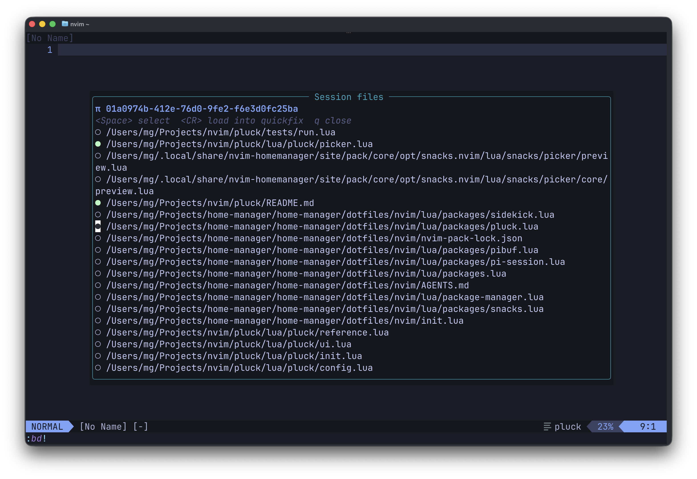
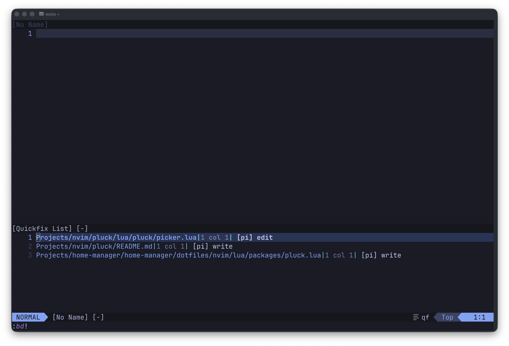

# pluck.nvim

Pluck discovers sessions from pi, Claude Code, and OpenCode—including sessions in custom locations—and presents them newest-first in a Snacks picker. Selecting a session opens its referenced files in a configurable float, tab, or split; choose files with `<Space>` and press `<CR>` to load the selection, or every file when none is selected, into the quickfix list.

## Flow

- Run `:PluckSessions` to open the session picker:



- Select a session and select the files with `j`/`k` and `<Space>`. Press `<CR>` to finish.



- Selected files are in the quickfix list.



## Install

Requires Neovim 0.9+, [snacks.nvim](https://github.com/folke/snacks.nvim), and `sqlite3` for OpenCode sessions.

With `vim.pack`:

```lua
vim.pack.add({
  "https://github.com/mg/pluck.nvim",
  "https://github.com/folke/snacks.nvim",
})

require("pluck").setup()
vim.keymap.set("n", "<leader>ap", function()
  require("pluck").pick()
end, { desc = "Pick Pluck Session" })
```
